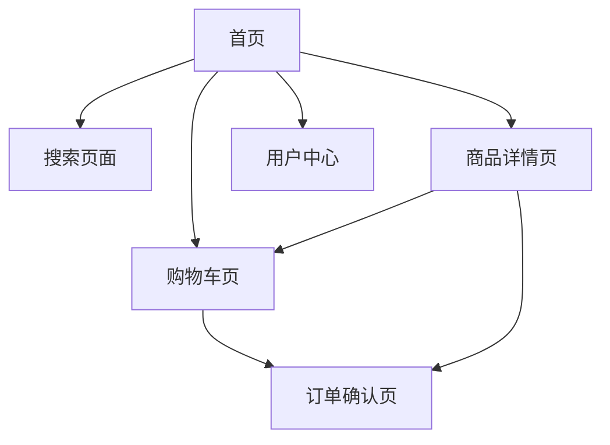

## 1. 产品概述
这是一个移动端电商网站，提供商品浏览、搜索和购买功能。用户可以通过手机轻松浏览商品、搜索感兴趣的产品，并享受便捷的购物体验。

目标用户群体：移动端购物用户，追求简洁高效的购物体验。

## 2. 核心功能

### 2.1 用户角色
| 角色 | 注册方式 | 核心权限 |
|------|----------|----------|
| 普通用户 | 手机号/邮箱注册 | 浏览商品、搜索、添加购物车、下单购买 |
| 游客用户 | 无需注册 | 浏览商品、搜索 |

### 2.2 功能模块
我们的电商网站包含以下主要页面：
1. **首页**：搜索栏、快捷操作、轮播banner、分类展示、商品列表、底部导航
2. **商品详情页**：商品图片、价格、描述、购买按钮
3. **购物车页**：商品列表、价格统计、结算按钮
4. **用户中心**：个人信息、订单管理、设置

### 2.3 页面详情
| 页面名称 | 模块名称 | 功能描述 |
|----------|----------|----------|
| 首页 | 状态栏 | 显示时间、网络状态、电池电量 |
| 首页 | 搜索栏 | 输入商品关键词搜索，显示搜索历史 |
| 首页 | 快捷操作 | 收藏夹、浏览历史、关注商品快速入口 |
| 首页 | 轮播banner | 展示促销活动，支持左右滑动切换 |
| 首页 | 分类展示 | 横向滚动显示商品分类，点击可筛选 |
| 首页 | 商品网格 | 展示商品卡片，包含图片、品牌、名称、价格 |
| 首页 | 底部导航 | 首页、发现、购物车、通知、我的五个tab切换 |
| 商品详情页 | 商品图片 | 支持放大查看，多张图片轮播 |
| 商品详情页 | 商品信息 | 显示品牌、名称、价格、库存等基本信息 |
| 商品详情页 | 购买操作 | 加入购物车、立即购买按钮 |
| 购物车页 | 商品列表 | 显示已添加商品，可修改数量或删除 |
| 购物车页 | 价格统计 | 实时计算商品总价 |
| 购物车页 | 结算按钮 | 跳转到订单确认页面 |
| 用户中心 | 个人信息 | 显示头像、昵称、会员等级 |
| 用户中心 | 订单管理 | 查看历史订单状态 |

## 3. 核心流程
用户主要操作流程：
1. 打开应用进入首页，可以浏览推荐商品或使用搜索功能
2. 点击商品进入详情页，查看详细信息后可加入购物车或直接购买
3. 在购物车中确认商品信息，进行结算
4. 在个人中心管理订单和查看个人信息

## 4. 用户界面设计

### 4.1 设计风格
- **主色调**：白色背景，深色文字，简洁现代风格
- **按钮样式**：圆角矩形，细边框设计，浅色背景
- **字体**：系统默认字体，标题16-18px加粗，正文14px常规
- **布局风格**：卡片式布局，上下滑动浏览，横向滚动分类
- **图标风格**：线性图标，简洁易懂

### 4.2 页面设计概述
| 页面名称 | 模块名称 | UI元素 |
|----------|----------|----------|
| 首页 | 搜索栏 | 圆角输入框，左侧搜索图标，灰色占位文字 |
| 首页 | 快捷操作 | 圆角胶囊按钮，浅色背景，细边框，图标+文字 |
| 首页 | 轮播banner | 圆角矩形图片，底部指示器，标题文字 |
| 首页 | 商品卡片 | 圆角图片容器，品牌名灰色小字，品名黑色中字，价格黑色加粗 |
| 首页 | 底部导航 | 图标+文字，选中状态高亮，未选中灰色 |

### 4.3 响应式设计
- 采用移动端优先设计策略
- 适配各种手机屏幕尺寸
- 触摸交互优化，按钮点击区域足够大
- 支持手势操作：滑动、捏合、长按等