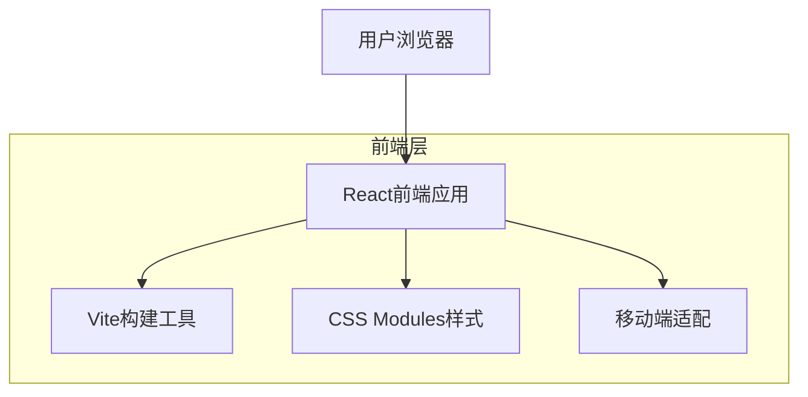

## 1. 架构设计



## 2. 技术栈描述

- **前端框架**: React@18 + Vite@4
- **样式方案**: CSS Modules (SCSS)
- **构建工具**: Vite-init
- **移动端适配**: Flexible布局 + REM单位
- **图标库**: React-icons
- **路由管理**: React-router-dom@6

## 3. 路由定义

| 路由路径 | 页面用途 |
|---------|---------|
| / | 首页，展示商品推荐和核心功能 |
| /search | 搜索页面，显示搜索结果 |
| /product/:id | 商品详情页，显示商品详细信息 |
| /cart | 购物车页面，管理已选商品 |
| /profile | 个人中心，用户信息和管理 |
| /category/:id | 分类页面，按分类展示商品 |

## 4. 组件架构

### 4.1 核心组件类型定义

```typescript
// 商品类型定义
interface Product {
  id: string;
  name: string;
  brand: string;
  price: number;
  originalPrice?: number;
  image: string;
  category: string;
  stock: number;
  description: string;
}

// 分类类型定义
interface Category {
  id: string;
  name: string;
  icon: string;
  productCount: number;
}

// 购物车项目类型定义
interface CartItem {
  product: Product;
  quantity: number;
  selected: boolean;
}
```

### 4.2 组件结构

```
src/
├── components/           # 公共组件
│   ├── common/          # 通用组件
│   │   ├── Button/      # 按钮组件
│   │   ├── Card/        # 卡片组件
│   │   └── Icon/        # 图标组件
│   ├── layout/          # 布局组件
│   │   ├── Header/      # 头部导航
│   │   ├── Footer/      # 底部导航
│   │   └── SearchBar/   # 搜索栏
│   └── business/        # 业务组件
│       ├── ProductCard/ # 商品卡片
│       ├── Banner/      # 轮播图
│       └── CategoryList/# 分类列表
├── pages/               # 页面组件
│   ├── Home/           # 首页
│   ├── ProductDetail/  # 商品详情
│   ├── Cart/          # 购物车
│   └── Profile/       # 个人中心
├── styles/             # 样式文件
│   ├── variables.scss # 样式变量
│   ├── mixins.scss    # 样式混合
│   └── global.scss    # 全局样式
└── utils/              # 工具函数
    ├── responsive.ts  # 响应式工具
    └── format.ts      # 格式化工具
```

## 5. 移动端适配方案

### 5.1 响应式设计
- 使用Flexible布局实现REM适配
- 基准尺寸：375px设计稿，100px = 1rem
- 媒体查询断点：
  - 小屏手机：< 375px
  - 标准手机：375px - 414px
  - 大屏手机：> 414px

### 5.2 触摸优化
- 点击区域最小44px × 44px
- 支持触摸滑动、捏合等手势
- 防止误触的防抖处理

## 6. 性能优化策略

### 6.1 代码分割
- 路由级别的代码分割
- 组件懒加载
- 图片懒加载

### 6.2 渲染优化
- 虚拟列表处理长列表
- 组件缓存机制
- 避免不必要的重渲染

## 7. 开发规范

### 7.1 命名规范
- 组件名：PascalCase
- 文件名：camelCase
- CSS类名：kebab-case
- 常量：UPPER_SNAKE_CASE

### 7.2 代码组织
- 单一职责原则
- 组件化开发
- 样式模块化
- 清晰的文件结构